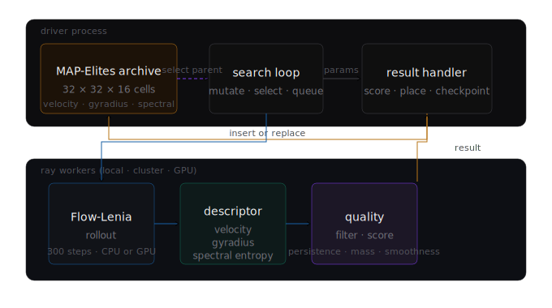
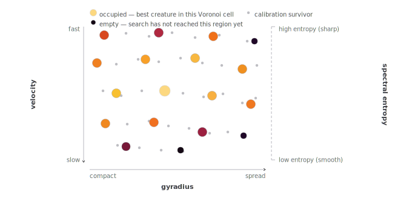

# biota

Quality-diversity search and population dynamics for Flow-Lenia creatures.

It runs locally, on a single GPU, or across a Ray cluster, and produces an archive of structurally distinct creatures that can be explored individually or studied collectively.

<p align="center">
  <a href="https://youtu.be/ZFrRKZXiH2Q">
    
  </a>
</p>

<p align="center">
  <small><i>Click the GIF to watch the full archive demo video</i></small>
</p>

## What it does

[Flow-Lenia](https://arxiv.org/abs/2212.07906) is a continuous cellular automaton where matter is conserved by construction. Unlike vanilla Lenia, mass conservation prevents the explode/collapse failure modes that dominate its parameter space, producing life-like creatures across a much wider range of parameters. The creatures are solitons - stable, self-maintaining patterns that persist indefinitely given the right parameters.

biota searches Flow-Lenia's parameter space using [MAP-Elites](https://arxiv.org/abs/1504.04909). Rather than finding a single best creature, it fills a behavioral grid where each cell holds the highest-quality creature found with a particular phenotypic fingerprint. The result is an atlas: a structured catalog of qualitatively distinct life-forms that covers the behavioral space as broadly as possible.

A 500-rollout standard-preset search on a 24-core cluster takes about 340 seconds and produces around 228 distinct archive cells at a 45% insertion rate.

## How it works

The search loop runs in the driver process. Rollouts are dispatched as Ray tasks to workers - stateless functions that take parameters, simulate a creature, compute its behavioral descriptors and quality score, and return a result. The driver places results into the archive, selects parents for mutation, and queues the next batch. Nothing persistent lives on the workers.



The archive is a 3D MAP-Elites grid. Each axis encodes one aspect of a creature's behavior, measured empirically from the rollout rather than from the parameter values themselves:

- **velocity** - mean displacement of the creature's center of mass per step, normalized against observed population range
- **gyradius** - mass-weighted RMS distance from the center of mass, a smooth measure of how spread-out the creature is
- **spectral entropy** - Shannon entropy of the radially-averaged FFT magnitude spectrum of the final state, remapped against the actual population floor; distinguishes sharp-structured creatures from smooth blobs

The grid is 32 × 32 × 16. Each occupied cell holds the best creature found with that behavioral fingerprint - its parameters, quality score, thumbnail animation, and lineage.



## Quickstart

```bash
git clone https://github.com/rkv0id/biota
cd biota
uv sync
uv run biota search --preset dev --budget 50
```

This runs 50 rollouts synchronously on CPU. When it finishes, view the archive:

```bash
uv run python scripts/view_archive.py
open runs/<run_id>/view.html
```

The output is a self-contained HTML file - every creature rendered as an animated magma-colorized thumbnail, with hover tooltips showing descriptor values and a click-through modal with full parameters and lineage. No server required, works offline, can be scped off a cluster.

To regenerate all run views and build a browsable index:

```bash
uv run python scripts/build_index.py
open runs/index.html
```

## Running on a cluster

```bash
# On the head node
ray start --head --node-ip-address=<ip> --port=6379 --num-gpus=<n>

# On each worker node
ray start --address=<ip>:6379 --num-gpus=<n>

# Run from the head node (with biota installed into the runtime venv)
biota search --ray-address <ip>:6379 --preset standard --budget 500 \
    --device cuda --gpus-per-rollout 0.25 --max-concurrent 12
```

`--gpus-per-rollout 0.25` runs four rollouts per GPU simultaneously. On RTX 5060 Ti hardware, this gives 2.4x the throughput of exclusive-GPU mode with 77-79% sustained utilization.

Three presets: `dev` (64x64 grid, 200 steps, fast iteration), `standard` (192x192, 300 steps, reference quality), `pretty` (384x384, 500 steps, maximum visual fidelity for publishing).

## CLI reference

`biota search` flags:

| Flag | Default | Description |
|---|---|---|
| `--preset` | `standard` | `dev`, `standard`, or `pretty` |
| `--budget` | `500` | Total rollouts |
| `--random-phase` | `200` | Uniform random rollouts before mutation starts |
| `--max-concurrent` | `8` | In-flight rollout cap |
| `--device` | `cpu` | `cpu`, `mps`, or `cuda` |
| `--gpus-per-rollout` | `1.0` | GPU fraction per rollout (set to `0.25` for 4 per GPU) |
| `--local-ray` | off | Start a fresh local Ray instance |
| `--ray-address` | none | Attach to an existing Ray cluster |
| `--base-seed` | `0` | Reproducibility seed |
| `--checkpoint-every` | `100` | Archive checkpoint cadence (rollouts) |

`biota doctor` checks Python, torch, device availability, Ray, and biota module health.

## Run output

```
runs/20260408-175341-quiet-junco/
├── manifest.json       # run metadata, biota version, git commit
├── config.json         # exact SearchConfig used
├── archive.pkl         # MAP-Elites archive, rewritten on checkpoint
└── events.jsonl        # append-only log of every rollout outcome
```

## Development

```bash
just check       # ruff + pyright + pytest (142 tests)
just smoke-ray   # Ray-mode smoke test
```

The test suite does not require a GPU or a running Ray cluster. `just smoke-ray` exercises the Ray code path that pytest cannot reach; run it after any change to `ray_compat.py`.

## Roadmap

- **v0.1.0** Flow-Lenia PyTorch port, mass conservation verified against JAX reference ✅
- **v0.2.0** Driver, Ray runtime, search loop, multi-node GPU Ray ✅
- **v0.3.0** Perf fixes, descriptor rework, visual pipeline, static index with metrics - *closing out*
- **v1.0.0** Lineage view + public atlas at `rkv0id.github.io/biota/`
- **v2.0.0** Ecosystem simulation - spawn archive creatures together on a large grid and study what happens
- **v3.0.0** Learned descriptors

## References

- Plantec et al. 2022, [Flow-Lenia](https://arxiv.org/abs/2212.07906) (best paper, ALIFE 2023)
- Plantec et al. 2025, [Flow-Lenia journal version](https://arxiv.org/abs/2506.08569)
- [Reference JAX implementation](https://github.com/erwanplantec/FlowLenia)
- Mouret and Clune 2015, [MAP-Elites](https://arxiv.org/abs/1504.04909)
