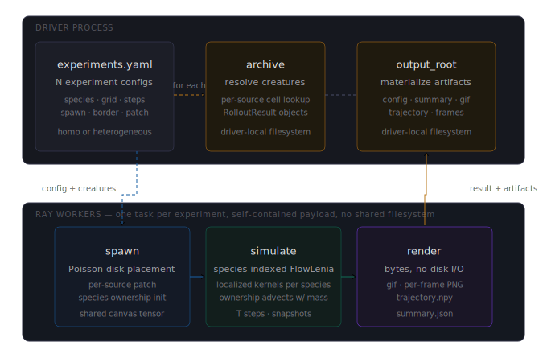

<h1>
  &nbsp;biota
</h1>

Distributed Flow-Lenia discovery platform. MAP-Elites search, behavioral archive, ecosystem simulation, chemical signal field.

[](https://youtu.be/LdY0mSIYzy8)

biota runs MAP-Elites searches across a Ray cluster, dispatching batches of [Flow-Lenia](https://arxiv.org/abs/2212.07906) simulations as vectorized PyTorch forward passes to stateless GPU workers, producing a structured behavioral archive of distinct artificial life-forms. The full experimental loop: configure behavioral descriptors, search the parameter space, explore the archive, seed ecosystem simulations from selected creatures. An optional signal field adds a shared chemical medium to both search and ecosystem runs: each creature emits into and senses from a 16-channel field, enabling signal-mediated interaction alongside mass dynamics.

## How it works

[Flow-Lenia](https://arxiv.org/abs/2212.07906) is a continuous cellular automaton where matter is conserved by construction. Mass conservation prevents the explode/collapse failure modes that dominate vanilla Lenia, producing stable solitons across a much wider range of parameters.

[MAP-Elites](https://arxiv.org/abs/1504.04909) searches that parameter space for behavioral diversity rather than a single optimum. Instead of one best creature, it fills a grid where each cell holds the highest-quality creature with a particular phenotypic fingerprint: an atlas of qualitatively distinct life-forms.

<p align="center"></p>

The driver owns the archive and the search loop. Each Ray task evaluates B creatures as a single `(B, H, W)` vectorized forward pass. One task fills one GPU. Workers are stateless; nothing persistent lives on the cluster between tasks.

<p align="center"></p>

`--workers N` controls how many batches are in flight simultaneously. `--workers 1` is synchronous MAP-Elites (maximally fresh archive). Higher values trade freshness for throughput on multi-node setups.

## Ecosystem simulation

Once the archive is populated, `biota ecosystem` takes specific archive cells and runs them on a shared grid to see how creatures interact. A homogeneous run spawns `N` copies of one species. A heterogeneous run mixes two or more species, each with its own full parameter set (kernel radii, growth windows, weights), using species-indexed LocalizedFlowLenia: per-cell species ownership tracks which lineage owns the local mass, blends growth fields by ownership, and advects with the flow.

After the simulation, a suite of spatial observables is computed from the captured snapshots -- no re-simulation required. For heterogeneous runs: patch count per species over time, interface area per species pair, center-of-mass distance per pair, and spatial entropy per species. For homogeneous runs: patch count over time, spatial entropy, and patch size distribution. Interaction coefficients are gated to snapshot windows where species actually co-occur, so they measure contact dynamics rather than spatial separation. A temporal outcome classifier assigns per-species labeled windows (coexistence, exclusion, merger, fragmentation for heterogeneous; stable_isolation, full_merger, partial_clustering, cannibalism, fragmentation for homogeneous) and derives a dominant run-level label shown as a badge in the viewer.

Ecosystem dispatch is Ray-correct: each experiment is a self-contained payload. The driver loads creatures from its local archive and ships them with the config; workers simulate and render to bytes; the driver materializes outputs locally. No shared filesystem is assumed at any step, so experiments run correctly on real multi-node clusters without NFS or rsync setup.

<p align="center"></p>

## Behavioral descriptors

The archive grid has three axes, each a scalar measured empirically from the rollout. Choose any three from the built-in library of fifteen:

| Descriptor | What it captures |
|---|---|
| `velocity` | Mean COM displacement per step over the trailing 50 steps |
| `gyradius` | Mass-weighted RMS distance from the center of mass |
| `spectral_entropy` | Shannon entropy of the radially-averaged FFT spectrum |
| `oscillation` | Variance of bounding-box fraction over the trace tail |
| `compactness` | Mass inside bounding box / total mass at the final step |
| `mass_asymmetry` | Directional bias of motion: straight movers vs orbiters |
| `png_compressibility` | PNG compressed/uncompressed ratio of the final state |
| `rotational_symmetry` | Angular variance of radial mass profile |
| `persistence_score` | Max descriptor drift across the trace tail |
| `displacement_ratio` | Total displacement / total path length (0 = orbiter, 1 = glider) |
| `angular_velocity` | Mean absolute angular speed of COM motion |
| `growth_gradient` | Mass-weighted mean spatial gradient magnitude (internal edge density) |
| `morphological_instability` | Variance of gyradius over the trace tail (shape stability) |
| `activity` | Mean absolute gyradius change per step (internal work rate) |
| `spatial_entropy` | Shannon entropy of coarse spatial mass distribution |

With 15 built-ins there are C(15,3) = 455 possible archive configurations. Supply your own via `--descriptor-module`. The archive viewer renders all three axes: two as the spatial grid, the third as an interactive slice slider.

## Quickstart

```bash
git clone https://github.com/rkv0id/biota
cd biota
uv sync
uv run biota search --preset dev --budget 50
```

Runs 50 rollouts synchronously on CPU. Then build the viewer:

```bash
uv run python scripts/build_index.py --output-dir archive
open archive/index.html
```

Every creature is rendered as an animated magma-colorized thumbnail with hover tooltips, lineage highlighting, and a click-through modal with full parameters. No server required, fully self-contained HTML.

## Ecosystem simulation

Once you have an archive, define one or more ecosystem experiments in a YAML config and run them:

```bash
biota ecosystem --config experiments.yaml --device cuda
```

A minimal config defines what to spawn, on what grid, for how long:

```yaml
experiments:
  - name: dense-population
    grid: 512                     # 512 for square, [192, 512] for rectangular
    steps: 5000
    snapshot_every: 35
    border: torus                 # 'torus' or 'wall'
    output_format: gif            # 'gif' or 'frames'
    spawn:
      min_dist: 55                # min pixel distance between spawn centers
      patch: 32                   # initial random patch side length
      seed: 0
    sources:
      - run: 20260413-134355-hazy-creek
        cell: [5, 23, 13]
        n: 8
```

A heterogeneous experiment lists multiple sources. Each source contributes its own creature with its own full parameter set; species ownership is tracked per-cell and growth fields blend by ownership weight:

```yaml
experiments:
  - name: predator-prey
    grid: 512
    steps: 8000
    snapshot_every: 50
    border: torus
    output_format: gif
    spawn:
      min_dist: 60
      patch: 28              # default patch size for all sources
      seed: 42
    sources:
      - run: 20260413-134355-hazy-creek
        cell: [5, 23, 13]
        n: 6
      - archive_dir: archive-secondary    # optional per-source override
        run: 20260414-091122-still-pond
        cell: [22, 8, 11]
        n: 6
        patch: 48            # this species spawns at a larger scale
```

Each source can override the experiment's `spawn.patch` with its own value. Useful when species in a heterogeneous run have different natural scales; for example a small fast glider mixed with a large dense colony. The Poisson disk margin uses the largest patch in the run so creatures still fit safely inside the wall border. When omitted, sources fall back to the experiment's `spawn.patch`.

Multiple experiments in a single file run sequentially. After running, rebuild the index to include ecosystem results in the atlas:

```bash
python scripts/build_index.py \
    --output-dir archive \
    --ecosystem-dir ecosystem \
    --publish
```

## Signal field

The signal field is an optional chemical communication layer that operates on top of the mass dynamics. Enable it at search time with `--signal-field`:

```bash
biota search --preset standard --budget 2000 \
    --device cuda --batch-size 64 --workers 3 \
    --signal-field
```

This adds six signal parameters to each creature's searchable parameter space:

| Parameter | Shape | Range | Description |
|---|---|---|---|
| `emission_vector` | `(16,)` | `[0, 1]` | How emitted signal is distributed across the 16 channels |
| `receptor_profile` | `(16,)` | `[-1, 1]` | Channel weights for sensing. Negative values produce inhibitory (aversive) responses |
| `emission_rate` | scalar | `[0.001, 0.05]` | Fraction of positive growth activity converted to signal per step. Lower values reduce mass bleed over long ecosystem runs |
| `decay_rates` | `(16,)` | `[0, 0.9]` | Per-channel decay rate applied each step. Creatures with low decay on key channels maintain longer-range chemical gradients |
| `signal_kernel_r` | scalar | `[0.2, 1.0]` | Signal kernel radius scale |
| `signal_kernel_a/b/w` | `(3,)` each | same as mass kernels | Ring function parameters for signal diffusion |

**Physics.** At each step: (1) the creature emits signal proportional to local positive growth activity scaled by `emission_rate`, draining from the mass field into the signal field; (2) the signal field is convolved with the creature's signal kernel; (3) the dot product of the convolved field with `receptor_profile` boosts (or inhibits) the growth field; (4) the signal field decays per-channel at the creature's own `decay_rates`. The total conserved quantity is `mass + signal`. Decay is the only leak.

**Archive compatibility.** An archive produced with `--signal-field` is tagged `"signal_field": true` in `manifest.json`. Ecosystem runs detect this automatically from the creature params -- no YAML flag needed. If any source creature comes from a signal-enabled archive, all sources must too; mixing signal and non-signal archives raises an error at load time.

**Quality metric.** The alive filter checks that total mass (`mass + signal`) stays within `[0.5, 2.0]` of the initial total, and that the mass field itself does not collapse below 20% of its initial value (stricter than non-signal to create selection pressure against mass bleed). The quality score blends compactness (70%) with signal retention -- `final_mass / initial_mass` (30%) -- directly rewarding creatures that emit efficiently without depleting themselves. The initial signal field is spatially varied low-frequency noise (~0.01 amplitude) per channel, giving the receptor profile something to respond to during solo rollouts. Signal searches automatically use 800 steps (vs 500 for standard) so emission/reception dynamics have time to build up meaningful gradients.

## Relationship to related work

The closest published work is Plantec et al. 2025, [Exploring Flow-Lenia Universes](https://arxiv.org/abs/2506.08569). Both efforts run multi-rule Flow-Lenia on a shared grid, but the framing and mechanism are different.

Plantec's setup is a **universe search**: random P-field initialization, random kernel sets, and per-cell parameter embeddings that drift under the dynamics. Speciation emerges in-simulation because the P field itself evolves and can carve out distinct regions over time. Only the growth-window vector `h` is localized; kernel parameters (R, r, a, b, w) are shared across the grid because spatial variation in those would break the FFT factorization the step relies on.

biota's heterogeneous mode is a **curated gene-pool ecosystem**. The creatures are not random; they come from a MAP-Elites archive built by the search loop, each one a behavioral variant validated by descriptors and quality. A heterogeneous run picks specific archive cells, treats each as a species, and gives every species its own complete parameter set: R, r, a, b, w, and the h vector. The cost is one FFT pass per species per step; the upshot is that the species in the run are interpretable, reproducible, and selectable from the same descriptor space the atlas exposes. Species ownership is tracked per cell as a simplex weight that advects with the mass; growth fields blend by ownership. There is no in-simulation speciation in v2.2.0: the species count is fixed at the start of the run.

The two approaches answer different questions. Plantec asks "what kinds of universes does Flow-Lenia generate from random initial conditions?". biota asks "what happens when these specific creatures, found by search, are placed together?". The first is open-ended exploration of universe space; the second is hypothesis-driven study of the archive. They are complementary, and the heterogeneous code path here borrows the per-cell ownership idea from Plantec while keeping each species' parameters intact.

## Running on a cluster

```bash
# On every node
just cluster-install && source ~/.biota-runtime/bin/activate

# Head node
ray start --head --node-ip-address=<ip> --port=6379 --num-gpus=1

# Worker nodes
ray start --address=<ip>:6379 --num-gpus=1

# Search
biota search --ray-address <ip>:6379 \
    --preset standard --budget 500 \
    --device cuda --batch-size 64 --workers 3

# With a custom descriptor set
biota search --ray-address <ip>:6379 \
    --preset standard --budget 2000 \
    --device cuda --batch-size 64 --workers 3 \
    --descriptors oscillation,compactness,png_compressibility
```

Three presets: `dev` (64x64, 200 steps), `standard` (192x192, 300 steps), `pretty` (384x384, 500 steps).

## CLI reference

### `biota search`

| Flag | Default | Description |
|---|---|---|
| `--preset` | `standard` | `dev`, `standard`, or `pretty` |
| `--budget` | `500` | Total rollouts |
| `--random-phase` | `200` | Uniform random rollouts before mutation |
| `--batch-size` | `1` | Rollouts per dispatch. 32-128 on cuda/mps |
| `--workers` | `1` | Concurrent batch dispatches. 1 = synchronous MAP-Elites |
| `--device` | `cpu` | `cpu`, `mps`, or `cuda` |
| `--local-ray` | off | Start a fresh local Ray instance |
| `--ray-address` | none | Attach to an existing Ray cluster |
| `--base-seed` | `0` | Reproducibility seed |
| `--checkpoint-every` | `100` | Checkpoint cadence in rollouts |
| `--descriptors` | `velocity,gyradius,spectral_entropy` | Three descriptor names, comma-separated |
| `--descriptor-module` | none | Path to a Python file defining custom `Descriptor` objects |
| `--signal-field` | off | Enable signal field parameters (emission, reception, kernel) in search. Produces a signal-enabled archive tagged in `manifest.json`. Signal and non-signal archives cannot be mixed in ecosystem runs |
| `--output-dir` | `archive` | Directory for run output |

### `biota ecosystem`

Experiment-level parameters (grid, steps, sources, spawn) live in the YAML config. CLI flags carry only infrastructure.

| Flag | Description |
|---|---|
| `--config` | Path to a YAML file defining one or more experiments (required) |
| `--archive-dir` | Default archive directory; sources may override per-entry. Default: `archive` |
| `--output-dir` | Root directory for ecosystem run output. Default: `ecosystem` |
| `--device` | `cpu`, `mps`, or `cuda`. Default: `cpu` |
| `--local-ray` | Start a fresh local Ray instance and run experiments in parallel. Mutually exclusive with `--ray-address` |
| `--ray-address` | Attach to an existing Ray cluster at `HOST[:PORT]` (or `ray://host:port` for the Client protocol) and run experiments in parallel |
| `--workers` | Maximum experiments running concurrently when Ray is active. Defaults to detected CUDA GPU count, or 1 |
| `--gpu-fraction` | Fraction of a GPU each worker reserves. Defaults from `--device`: `1.0` for `cuda` (one worker per GPU), `0` for `cpu` and `mps`. Set explicitly to pack workers per GPU (e.g. `0.5` with `--device cuda` runs two workers per GPU). Combinations like `--device cuda --gpu-fraction 0` are rejected as contradictory; combinations like `--device cpu --gpu-fraction 0.5` print a warning since they idle GPU resources |

`biota doctor` checks Python, torch, device availability, Ray, and module health (search, ray_compat, ecosystem).

## Run output

### Archive runs
```
archive/20260413-134355-hazy-creek/
├── manifest.json       # run metadata, biota version, preset, descriptors used
├── config.json         # exact SearchConfig serialized
├── archive.pkl         # MAP-Elites archive, rewritten on checkpoint
├── events.jsonl        # append-only log of every rollout outcome
├── thumbs/             # per-cell animated GIFs (--publish mode)
├── view.html           # interactive archive viewer
└── index.html          # top-level atlas (in archive/ root)
```

### Ecosystem runs
```
ecosystem/20260415-104007-096-dense-population/
├── config.json         # resolved experiment configuration
├── summary.json        # mode, sources, measures (mass history, spatial observables,
│                       # interaction coefficients, outcome label and temporal sequence)
├── ecosystem.gif       # animated GIF output (gif mode)
├── frames/             # individual PNG snapshots (frames mode)
├── trajectory.npy      # raw float32 mass snapshots (n_snapshots, H, W)
└── view.html           # ecosystem viewer: mass/territory/patch count/entropy charts,
                        #   interface area and COM distance per pair, interaction heatmap,
                        #   outcome timeline
```

## Development

```bash
just check       # ruff + pyright + pytest (397 tests, 0 warnings)
just smoke-ray   # local-Ray integration smoke test
```

The test suite runs entirely in no-Ray mode. `just smoke-ray` exercises the Ray code path and should be run after any change to `ray_compat.py`.

## Roadmap

- [x] v0.1.0 - Flow-Lenia PyTorch port, mass conservation verified against JAX reference
- [x] v0.2.0 - Driver, Ray runtime, search loop, multi-node GPU verified
- [x] v0.3.0 - Descriptor rework, visual pipeline, static index, per-run metrics
- [x] v0.4.0 - Batched rollout engine, 3.5x cluster speedup
- [x] v1.0.0 - Lineage view, atlas site, public launch at [biota-atlas.pages.dev](https://biota-atlas.pages.dev)
- [x] v1.1.0 - 9 built-in descriptors, `--descriptors` CLI, per-axis archive filtering, custom descriptor API
- [x] v2.0.0 - Ecosystem simulation: spawn archive creatures on a shared grid, animated GIF output, rectangular grids
- [x] v2.1.0 - 15 built-in descriptors (displacement ratio, angular velocity, growth gradient, morphological instability, activity, spatial entropy)
- [x] v2.2.0 - Heterogeneous ecosystems: multi-source YAML configs, species-indexed parameter localization, per-cell ownership tracking
- [x] v2.3.0 - Per-source `patch` override; parallel ecosystem dispatch via Ray (`--local-ray`, `--ray-address`, `--workers`, `--gpu-fraction`); sidebar layout with pan/zoom canvas
- [x] v2.4.0 - Cluster-safe ecosystem dispatch: driver-side creature loading and driver-side output materialization; transport×device smoke test grid
- [x] v2.5.0 - Species-colored ecosystem rendering, per-species territory and mass charts, mobile layout overhaul
- [x] v3.0.0 - Growth field capture, empirical S×S interaction coefficient matrix, ecosystem outcome classification, interaction heatmap in viewer
- [x] v3.1.0 - Spatial observables for both run modes: patch count, interface area, COM distance, spatial entropy (from existing snapshots, no new simulation code); interaction coefficients gated to contact windows; blended pair colors in viewer
- [x] v3.2.0 - Temporal outcome classifier: per-species labeled windows, patch-count-based fragmentation, separate taxonomies for homogeneous and heterogeneous runs, outcome timeline in viewer
- [x] v3.3.0 - Signal field: per-creature emission and sensing in a shared (H, W, 16) chemical field; switchable via --signal-field; archive-level tagging; quality filter updated for mass+signal conservation; both homo and hetero ecosystem paths signal-aware
- [x] v3.4.0 - Signal physics corrected: per-creature emission_rate and decay_rates (searchable);
  standard preset 500 steps, signal_preset 800 steps; CREATURE_MASS_FLOOR 0.2; signal_retention
  quality term; signal observables (total history, mass fraction, receptor alignment,
  emission-reception matrix); SIGNAL badge on archives; signal params in creature modal;
  signal overlay checkbox on ecosystem GIF; outcome label tooltips
- [ ] v3.5.0 - Ecosystem viewer overhaul: all new charts, signal GIF overlay, mode-specific panels, temporal outcome sequence

## References

- Plantec et al. 2022/2025, [Flow-Lenia](https://arxiv.org/abs/2212.07906)
- Mouret and Clune 2015, [MAP-Elites](https://arxiv.org/abs/1504.04909)
- Faldor and Cully 2024, [Leniabreeder](https://arxiv.org/abs/2406.04235)
- Michel et al. 2025, [Exploring Flow-Lenia Universes](https://arxiv.org/abs/2505.15998)
- [Reference JAX implementation](https://github.com/erwanplantec/FlowLenia)
