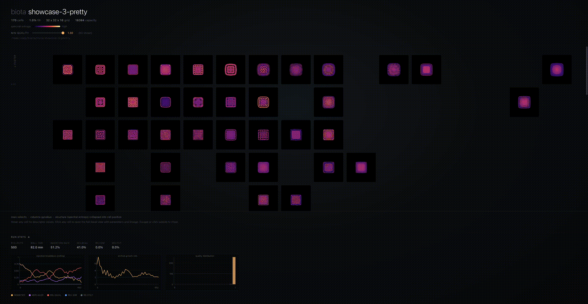

<h1>
  &nbsp;biota
</h1>

Distributed Flow-Lenia discovery platform. MAP-Elites search, behavioral archive, ecosystem simulation. Explore the live atlas at **[biota-atlas.pages.dev](https://biota-atlas.pages.dev)**.

[](https://youtu.be/ZFrRKZXiH2Q)

biota runs MAP-Elites searches across a Ray cluster, dispatching batches of [Flow-Lenia](https://arxiv.org/abs/2212.07906) simulations as vectorized PyTorch forward passes to stateless GPU workers, producing a structured behavioral archive of distinct artificial life-forms. The full experimental loop: configure behavioral descriptors, search the parameter space, explore the archive, seed ecosystem simulations from selected creatures.

**500 rollouts · 3 nodes · 97 seconds · 229 archive cells**

## How it works

[Flow-Lenia](https://arxiv.org/abs/2212.07906) is a continuous cellular automaton where matter is conserved by construction. Mass conservation prevents the explode/collapse failure modes that dominate vanilla Lenia, producing stable solitons across a much wider range of parameters.

[MAP-Elites](https://arxiv.org/abs/1504.04909) searches that parameter space for behavioral diversity rather than a single optimum. Instead of one best creature, it fills a grid where each cell holds the highest-quality creature with a particular phenotypic fingerprint: an atlas of qualitatively distinct life-forms.

The driver owns the archive and the search loop. Each Ray task evaluates B creatures as a single `(B, H, W)` vectorized forward pass. One task fills one GPU. Workers are stateless; nothing persistent lives on the cluster between tasks.

```
driver (archive + loop)
    └── submit batch of B params
            ├── Ray worker 0: (B, H, W) → B results   [GPU 0]
            ├── Ray worker 1: (B, H, W) → B results   [GPU 1]
            └── Ray worker 2: (B, H, W) → B results   [GPU 2]
    └── insert results → update archive → next batch
```

`--workers N` controls how many batches are in flight simultaneously. `--workers 1` is synchronous MAP-Elites (maximally fresh archive). Higher values trade freshness for throughput on multi-node setups.

## Behavioral descriptors

The archive grid has three axes, each a scalar measured empirically from the rollout. Choose any three from the built-in library of nine:

| Descriptor | What it captures |
|---|---|
| `velocity` | Mean COM displacement per step over the trailing 50 steps |
| `gyradius` | Mass-weighted RMS distance from the center of mass |
| `spectral_entropy` | Shannon entropy of the radially-averaged FFT spectrum |
| `oscillation` | Variance of bounding-box fraction over the trace tail |
| `compactness` | Mass inside bounding box / total mass at the final step |
| `mass_asymmetry` | Directional bias of motion: straight movers vs orbiters |
| `png_compressibility` | PNG compressed/uncompressed ratio of the final state |
| `rotational_symmetry` | Angular variance of radial mass profile |
| `persistence_score` | Max descriptor drift across the trace tail |

With 9 built-ins there are C(9,3) = 84 possible archive configurations. Supply your own via `--descriptor-module`. The archive viewer renders all three axes: two as the spatial grid, the third as an interactive slice slider.

## Quickstart

```bash
git clone https://github.com/rkv0id/biota
cd biota
uv sync
uv run biota search --preset dev --budget 50
```

Runs 50 rollouts synchronously on CPU. Then build the viewer:

```bash
uv run python scripts/build_index.py
open runs/index.html
```

Every creature is rendered as an animated magma-colorized thumbnail with hover tooltips, lineage highlighting, and a click-through modal with full parameters. No server required, fully self-contained HTML.

## Running on a cluster

```bash
# On every node
just cluster-install && source ~/.biota-runtime/bin/activate

# Head node
ray start --head --node-ip-address=<ip> --port=6379 --num-gpus=1

# Worker nodes
ray start --address=<ip>:6379 --num-gpus=1

# Search
biota search --ray-address <ip>:6379 \
    --preset standard --budget 500 \
    --device cuda --batch-size 64 --workers 3

# With a custom descriptor set
biota search --ray-address <ip>:6379 \
    --preset standard --budget 2000 \
    --device cuda --batch-size 64 --workers 3 \
    --descriptors oscillation,compactness,png_compressibility
```

Three presets: `dev` (64x64, 200 steps), `standard` (192x192, 300 steps), `pretty` (384x384, 500 steps).

## CLI reference

| Flag | Default | Description |
|---|---|---|
| `--preset` | `standard` | `dev`, `standard`, or `pretty` |
| `--budget` | `500` | Total rollouts |
| `--random-phase` | `200` | Uniform random rollouts before mutation |
| `--batch-size` | `1` | Rollouts per dispatch. 32-128 on cuda/mps |
| `--workers` | `1` | Concurrent batch dispatches. 1 = synchronous MAP-Elites |
| `--device` | `cpu` | `cpu`, `mps`, or `cuda` |
| `--local-ray` | off | Start a fresh local Ray instance |
| `--ray-address` | none | Attach to an existing Ray cluster |
| `--base-seed` | `0` | Reproducibility seed |
| `--checkpoint-every` | `100` | Checkpoint cadence in rollouts |
| `--descriptors` | `velocity,gyradius,spectral_entropy` | Three descriptor names, comma-separated |
| `--descriptor-module` | none | Path to a Python file defining custom `Descriptor` objects |

`biota doctor` checks Python, torch, device availability, Ray, and module health.

## Run output

```
runs/20260412-152312-lithe-willow/
├── manifest.json       # run metadata, biota version, preset, descriptors used
├── config.json         # exact SearchConfig serialized
├── archive.pkl         # MAP-Elites archive, rewritten on checkpoint
└── events.jsonl        # append-only log of every rollout outcome
```

## Development

```bash
just check       # ruff + pyright + pytest (180 tests)
just smoke-ray   # local-Ray integration smoke test
```

The test suite runs entirely in no-Ray mode. `just smoke-ray` exercises the Ray code path and should be run after any change to `ray_compat.py`.

## Roadmap

- [x] v0.1.0 - Flow-Lenia PyTorch port, mass conservation verified against JAX reference
- [x] v0.2.0 - Driver, Ray runtime, search loop, multi-node GPU verified
- [x] v0.3.0 - Descriptor rework, visual pipeline, static index, per-run metrics
- [x] v0.4.0 - Batched rollout engine, 3.5x cluster speedup
- [x] v1.0.0 - Lineage view, atlas site, public launch at [biota-atlas.pages.dev](https://biota-atlas.pages.dev)
- [x] v1.1.0 - 9 built-in descriptors, `--descriptors` CLI, per-axis archive filtering, custom descriptor API
- [ ] v2.0.0 - Ecosystem simulation: spawn archive creatures on a shared grid
- [ ] v2.1.0 - Heterogeneous ecosystems with parameter localization
- [ ] v3.0.0 - Learned descriptors (AURORA-style autoencoder)

## References

- Plantec et al. 2022/2025, [Flow-Lenia](https://arxiv.org/abs/2212.07906)
- Mouret and Clune 2015, [MAP-Elites](https://arxiv.org/abs/1504.04909)
- Faldor and Cully 2024, [Leniabreeder](https://arxiv.org/abs/2406.04235)
- Michel et al. 2025, [Exploring Flow-Lenia Universes](https://arxiv.org/abs/2505.15998)
- [Reference JAX implementation](https://github.com/erwanplantec/FlowLenia)
